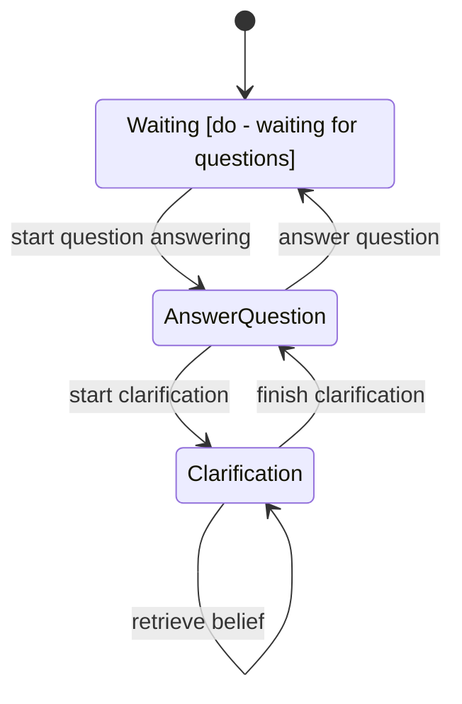

## State-based Question Answering

In this demo, we show case the ability of Sherpa to integrate state management and dictionary-based actions to answer questions and identify relations in different entities mentioned during the conversation. 

### State Machine
The state machine of the question answering action is shown below:



### Structure
* actions.py: actions used in the demo
* main.py: main file to run the demo
* states.py: states used in the demo

### Running the Demo
To run the demo, execute the following command in the terminal:

First, go to the demo folder:
```bash
cd demo/state_based_question_answering
```

Then, run the demo:
```bash
python main.py
```

Then you can start ask questions to the agent.
