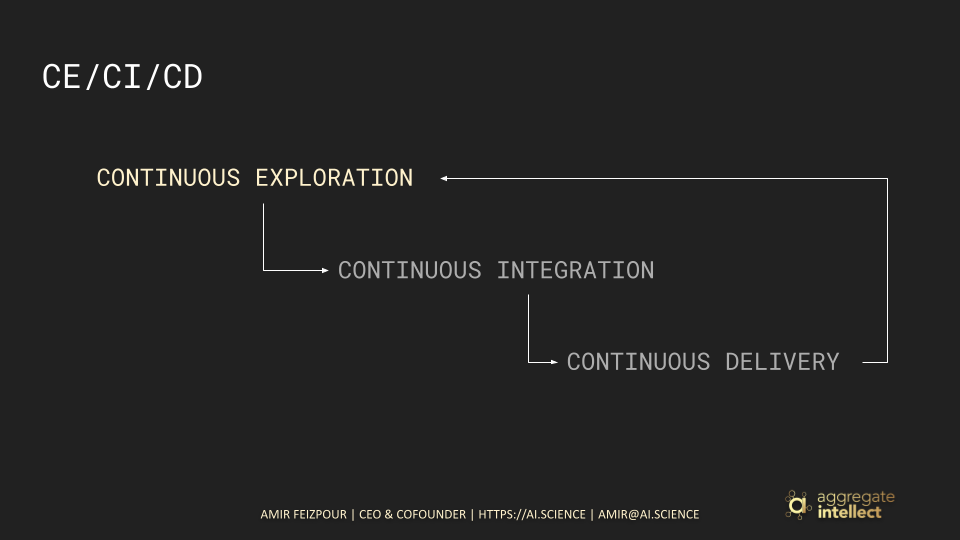
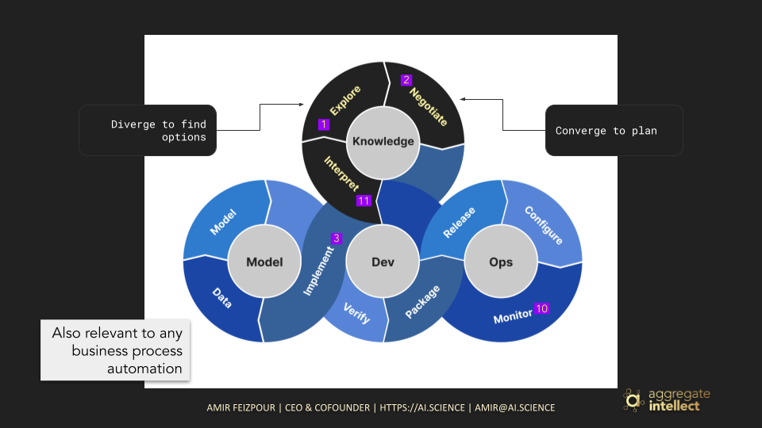
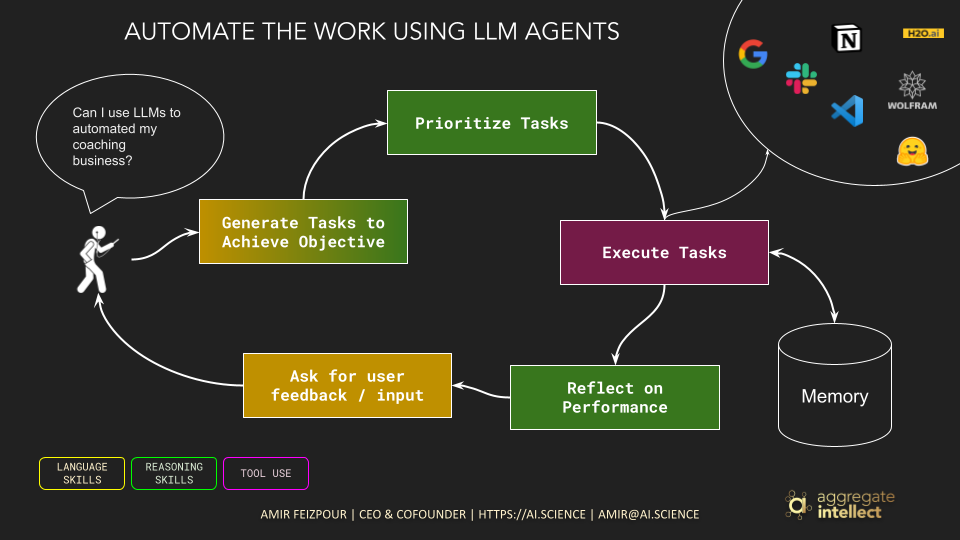
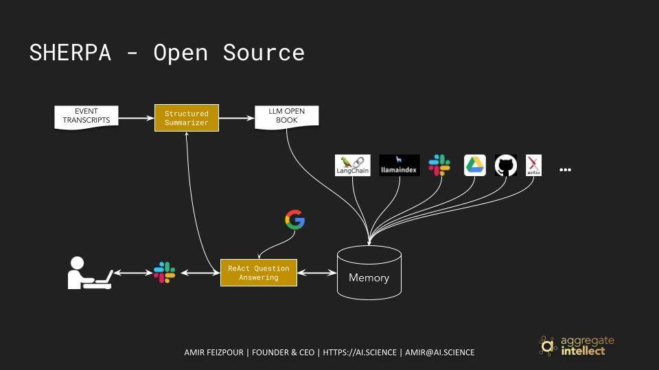

ABOUT SHERPA
============

What If...
^^^^^^^^^^

Has it happened to you that while you're doing something that is physically involved, say jogging or cooking or driving, a briliant idea hits you! What do you do?

Most of us, and given the current technological limtiations, as best take a note to look into the idea later.

But... **what if you could try that idea out as you are doing other activites by delegating it to machines?**

The idea of building machines that can genuinely replicate expert decision making process has been around for a few decades, from rule-based expert systems a few decades ago to the few waves of AI in the past two decades, to the newest and fanciest algorithms we have nowadays! 

The remarkable performance of large language models on linguistic tasks (including high level reasoning), has brought this question to the forefront again! The question that we are asking ourselves, more seriously than ever, is: can we build machines that can:

1. Reason through the process of completing a complex cognitive task
2. Explore potential approaches to decompose the task into subtasks and tools necessary to tackle those subtasks
3. Evaluate different approaches and priortize potentially high performing ones 
4. Continuously carry out the subtasks and integrate the outcome in the broader task handling strategy
5. Continuously synthesize everything and deliver to the end user or operator for feedback on further necessary explorations 

Continuous Exploration / Continuous Integration / Continuous Delivery
^^^^^^^^^^^^^^^^^^^^^^^^^^^^^^^^^^^^^^^^^^^^^^^^^^^^^^^^^^^^^^^^^^^^^

If we were to look into the history to find success stories in similar contexts in the past, we don't have to go too far! The concept of CI/CD is one of the corner stones of DevOps that empowers our knowledge workers, in this case developers, to focus on what they're good at: developing, and leave the process of testing, deploying, integrating, more testing, ... to automated or at least streamlined systems. 

The consequence of the shift in mindset and tooling that DevOps provided significantly reduced the cost of failiure. They could "ship" code faster and more frequently without having to spend time on everything that comes after putting their code out on a central repository, get feedback from the change, and iterate.

This immediate feedback loop, although still manual where you had to interprate the feedback and design the next step, remarkably reduced the cost of software development and among other factors led into numorus successful software businesses.

.. toctree::
    :maxdepth: 1

    Resources/index
    Updates/index