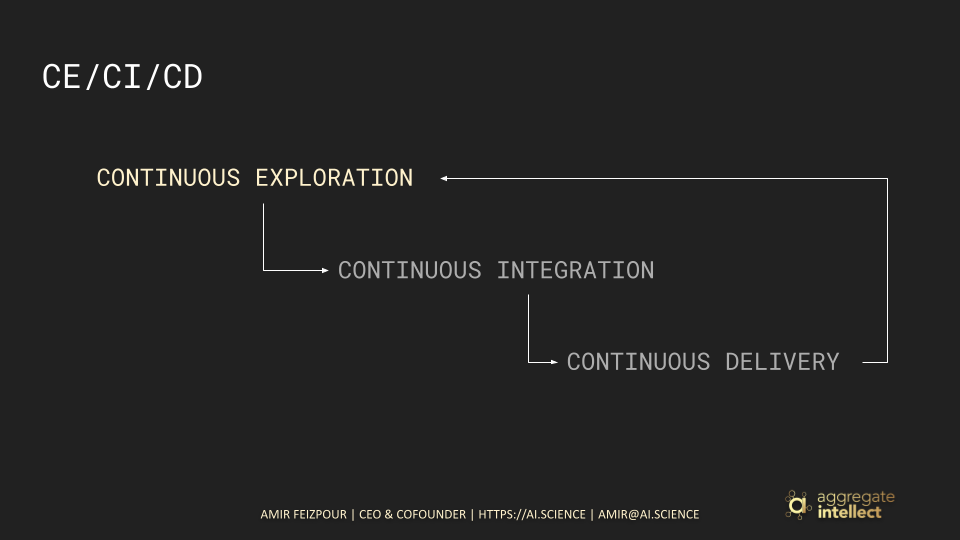
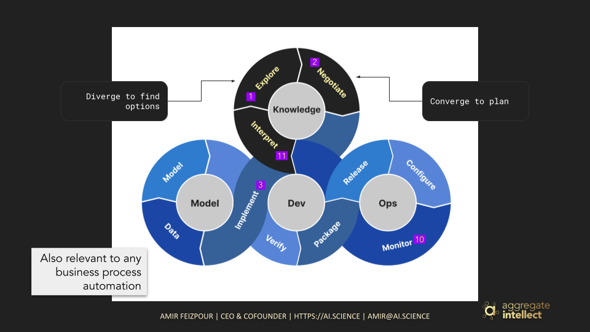
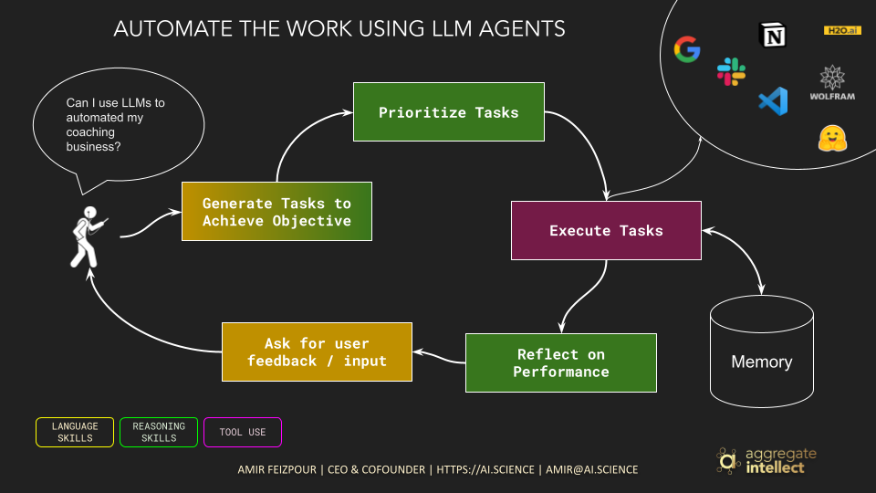
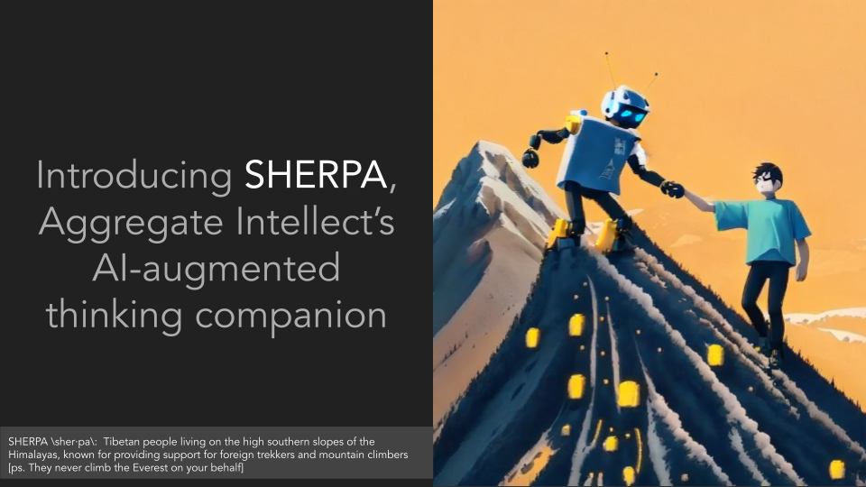
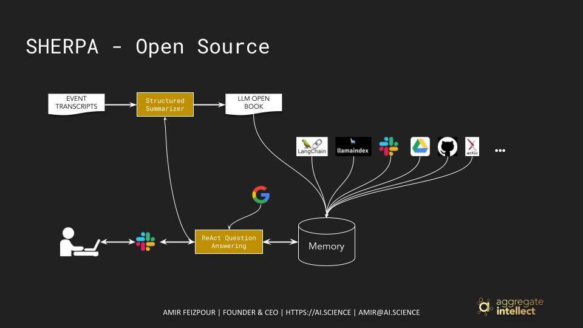
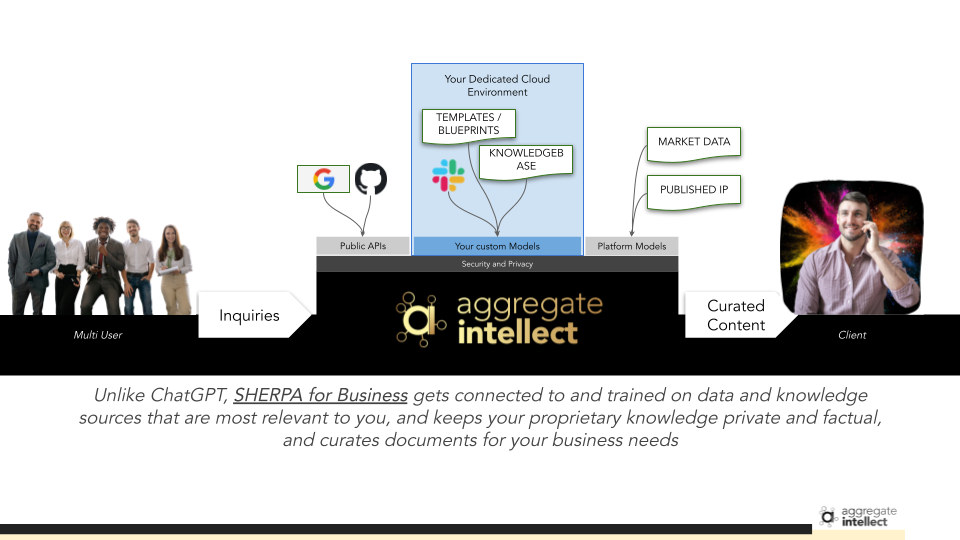

About Sherpa
============

What If...
^^^^^^^^^^

Has it happened to you that while you're doing something that is physically involved, say jogging or cooking or driving, a brilliant idea hits you! What do you do?

Most of us, and given the current technological limitations, as best take a note to look into the idea later.

But... **what if you could try that idea out as you are doing other activities by delegating it to machines?**

The idea of building machines that can genuinely replicate expert decision making process has been around for a few decades, from rule-based expert systems a few decades ago to the few waves of AI in the past two decades, to the newest and fanciest algorithms we have nowadays! 

The remarkable performance of large language models on linguistic tasks (including high level reasoning), has brought this question to the forefront again! The question that we are asking ourselves, more seriously than ever, is: can we build machines that can:

1. Reason through the process of completing a complex cognitive task
2. Explore potential approaches to decompose the task into subtasks and tools necessary to tackle those subtasks
3. Evaluate different approaches and prioritize potentially high performing ones 
4. Continuously carry out the subtasks and integrate the outcome in the broader task handling strategy
5. Continuously synthesize everything and deliver to the end user or operator for feedback on further necessary explorations 

Continuous Exploration / Continuous Integration / Continuous Delivery
^^^^^^^^^^^^^^^^^^^^^^^^^^^^^^^^^^^^^^^^^^^^^^^^^^^^^^^^^^^^^^^^^^^^^

If we were to look into the history to find success stories in similar contexts in the past, we don't have to go too far! 
The concept of CI/CD is one of the corner stones of DevOps that empowers our knowledge workers, in this case developers, to focus on what they're good at: developing, and leave the process of testing, deploying, integrating, more testing, ... to automated or at least streamlined systems. 

The consequence of the shift in mindset and tooling that DevOps provided significantly reduced the cost of failure. 
They could "ship" code faster and more frequently without having to spend time on everything that comes after putting their code out on a central repository, get feedback from the change, and iterate.

This immediate feedback loop, although still manual where you had to interpret the feedback and design the next step, remarkably reduced the cost of software development and among other factors led into numerous successful software businesses.

KnowledgeOps
^^^^^^^^^^^^

Although DevOps made a big difference in how software was developed, it still suffered from several manual steps that prevented it from being the `infinity` that we all desired!

- We still had to manually *inspect and interpret* the outcome of our latest effort.
- We still needed to manually *explore and research* our options to get closer to our objective.
- And we will needed to manually *negotiate and converge* to the few approaches that we could realistically try next.

*KnowledgeOps enters the room...*

KnowledgeOps is the set of tools and processes that automate and streamline any knowledge intensive workflows in an organization. 
In other words, KnowledgeOps *shifts further left* into the traditionally "human" stages of the workflows like "interpretation" and "synthesization" of knowledge.
KnowledgeOps aims to significantly improve an organizations ability to handle its knowledge for internal and external purposes.

*Is this too good to be true?*

Until very recently, yes! 
However, With the remarkable progress we have seen in the past few years where text based generative models started to perform on par with humans on language and tool use skills as well simpler reasoning abilities, all of a sudden there could be a way forward!
Large Language Models (LLMs), specifically, showed a great deal of competence in a few areas that are critical in handling knowledge more effectively:

- Language Skills: LLMs are very good at understanding and synthesizing language (at least for high resource languages like English, and common programming languages)
- Tool Use: Given that LLMs are good at understanding and generating formal language (read code), they have remarkable ability to use other tools to expand their capabilities by calling appropriate APIs.
- Reasoning Skills: Although still relatively primitive, but LLMs demonstrate the ability to reason (mostly the types of reasoning that are more likely to appear in the text of their training data)  

LLM Agents
^^^^^^^^^^

One of the most interesting trends of 2023 has been the "LLM Agents".
These are systems that use various LLM skills to create workflows that mimic an information / data intensive one that is usually manual but can be "automated" with collaborating "agents".
In other words, these systems devise the steps of the workflow you go through as you work towards an objective like decomposition of the main task into subtasks, planning and organization, reflection and repetition, and more to work iteratively towards a desired objective.
This could be writing the literature review section of a research paper, or drafting a blog post, or even carrying out a bunch of steps for creating and scheduling social media posts.

Introducing Sherpa
^^^^^^^^^^^^^^^^^^

In the past few years at aggregate intellect we have been focused on using AI to make interactions with documented "knowledge" more efficient and effective.

Some of the principles we have been following in designing and building our software systems are:

- These systems have to augment humans' ability to do complex tasks, rather than replacing them
- These systems have to facilitate multiplayer interactions like human-machine-human collaborations
- These systems have to be integrated into the typical workflows as an organic player

This has led us to `Sherpa`, our LLM Agent Management Library and set of Companion Apps. 

Sherpa - The Slack App
^^^^^^^^^^^^^^^^^^^^^^

We have released Sherpa, the agent management library and its corresponding slack app (so far), as an open source project supported by AISC community.
This projects aims to aggregate the intellect of our community, as well as the knowledge and expertise of the broader tech and entrepreneurship communities and enable the members of these communities to build better and bigger.

`This repository <https://github.com/Aggregate-Intellect/sherpa>`__ contains the source code for this project, and you are more than welcome to contribute.

Sherpa for Business
^^^^^^^^^^^^^^^^^^^

We do want to support entrepreneurship, both to build Sherpa and to build *using* Sherpa, through our open source project.
But we haven't forgotten about existing businesses.
We are creating managed and operationalized versions of Sherpa for businesses to use.

If you want to know more about *Sherpa for Business* reach out to sherpa@ai.science
