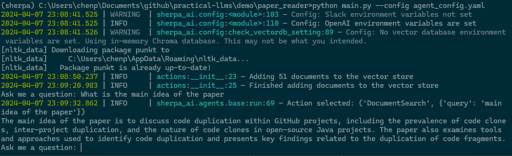

Create a PDF Reader with Sherpa
===============================

In this tutorial we will create a simple PDF reader using Sherpa. The PDF reader will be able to open a PDF file, load its content into a vector database and then use a question-answering agent and a web search agent to answer questions about the content of the PDF file.

Overview
********

To create the PDF reader we will define four components:

1. A text embedding tool to convert text and queries into vectors. We will use the SentenceTransformer library to meet this need.
2. A vector database to store the text embeddings of the PDF file. We will use Chroma in-memory vector database.
3. A customized Sherpa Action to enable a Sherpa agent to search the vector database.
4. A question answering agent to answer questions about the content of the PDF file. We will Sherpa's built-in QAAgent to do this.

Install dependencies
*********************

Step 1. Install Python **v3.9** using your preferred installation method.

Step 2. Create a folder for storing your tutorial code and PDF files:

.. code-block:: bash

    cd <your development directory>
    mkdir sherpa_tutorial
    cd sherpa_tutorial

Step 3. You may wish to create a virtual environment to isolate the Python libraries used 
for this tutorial from your other Python code. This step is optional. 

.. code-block:: bash

    python -m venv myvenv
    source myvenv/bin/activate

Step 4: Install the Sherpa library.

.. code-block:: bash

    pip install sherpa_ai

Step 5: install pdfminer.six for extracting text from PDF files and sentence-transformers for creating text embeddings:

.. code-block:: bash

    pip install pdfminer.six sentence-transformers

Define the custom action
************************
An action is an interface to tools that the agent can use to interact with data. In this case, we will create a custom action to enable the agent to search the vector database containing the content of the PDF file.

In the tutorial folder, create a file called `actions.py` and add the following code:

.. code-block:: python

    from langchain_community.document_loaders import PDFMinerLoader
    from langchain_community.embeddings.base import Embeddings
    from langchain_text_splitters import SentenceTransformersTokenTextSplitter
    from langchain_community.vectorstores.chroma import Chroma
    from loguru import logger
    from pydantic import ConfigDict

    from sherpa_ai.actions.base import BaseAction

    class DocumentSearch(BaseAction):
        model_config = ConfigDict(arbitrary_types_allowed=True)
        # file name of the pdf
        filename: str
        # the embedding function to use
        embedding_function: Embeddings
        # number of results to return in search
        k: int
        # the variables start with _ will not included in the __init__
        _chroma: Chroma
        # Override name and args properties from BaseAction
        # The name of the action, used to describe the action to the agent.
        name: str = "DocumentSearch"
        # The arguments that the action takes, used to describe the action to the agent.
        args: dict = {"query": "string"}
        # Description of action. Used semantically to determine when the action should be chosen by the agent
        usage: str = "Search the document store based on a query"

        def __init__(self, **kwargs):
            # initialize attributes using Pydantic BaseModel
            super().__init__(**kwargs)

            # load the pdf and create the vector store
            self._chroma = Chroma(embedding_function=self.embedding_function)
            documents = PDFMinerLoader(self.filename).load()
            documents = SentenceTransformersTokenTextSplitter(
                chunk_overlap=0
            ).split_documents(documents)

            logger.info(f"Adding {len(documents)} documents to the vector store")
            self._chroma.add_documents(documents)
            logger.info("Finished adding documents to the vector store")

        def execute(self, query):
            """
            Execute the action by searching the document store for the query

            Args:
                query (str): The query to search for

            Returns:
                str: The search results combined into a single string
            """

            results = self._chroma.search(query, search_type="mmr", k=self.k)
            return "\n\n".join([result.page_content for result in results])

.. note:: 
    
    Sherpa uses `Pydantic` to validate the definition of new components. Including action, agents and more. You can read more about Pydantic here: https://docs.pydantic.dev/latest/

The action is a crucial part of Sherpa enabling the agent to interact with other systems. In this case, the action we are creating is used for searching the vector database containing PDF content for the query.

This action will be passed to the QAAgent to enable the agent to search the vector database for the query.

There are three main parts in this action class:

1. `__init__`: This method initializes the action by loading the PDF file, creating the vector database and adding the documents to the vector database.

2. `execute`: This method executes the action by searching the vector database for the query and returning the search results.

3. `name` and `args`: These properties describe the action to agents that want to use it.

4. `usage`: This property explain the action purpose to help the LLM to better understand action.

Find a PDF file
****************

Next, locate a PDF file to use with the PDF reader. For example, we could use a research
paper like this one: https://arxiv.org/pdf/2401.07930.pdf. You can use any other PDF file you have. Save the PDF file in the same folder as the `actions.py` file. For simplicity, we will use the filename `paper.pdf` in this tutorial to refer to your PDF file.

Defining the agent configuration
*********************************

Next, we will create a configuration file for the agent. This configuration file will be directly parsed by Sherpa to create the agent such that no additional code is required. 

Create a file called `agent_config.yml` and add the following code:

.. code-block:: yaml

    shared_memory:
        _target_: sherpa_ai.memory.shared_memory.SharedMemory  # The absolute path to the share memory class in the library
        objective: Answer the question  # Objective for the agent, since this is a question answering agent, the objective is to answer questions

    agent_config: # For the demo, default configuration is used. You can change the configuration as per your requirement
        _target_: sherpa_ai.config.task_config.AgentConfig

    llm:  # Configuration for the llm, here we are using the OpenAI GPT-3.5-turbo model
        _target_: langchain_community.chat_models.ChatOpenAI
        model_name: gpt-3.5-turbo
        temperature: 0

    embedding_func: 
        _target_: langchain_community.embeddings.SentenceTransformerEmbeddings
        model_name: sentence-transformers/all-mpnet-base-v2

    doc_search:
        _target_: actions.DocumentSearch
        filename: paper.pdf
        embedding_function: ${embedding_func}
        k: 4

    qa_agent:
        _target_: sherpa_ai.agents.qa_agent.QAAgent
        llm: ${llm}
        shared_memory: ${shared_memory}
        name: QA Sherpa
        description: You are a question answering assistant helping users to find answers to their questions. Based on the input question, you will provide the answer from the text ONLY.
        agent_config: ${agent_config}
        num_runs: 1
        actions:
            - ${doc_search}

The `_target_` keys tell Sherpa which classes to use to instantiate various objects.

The DocumentSearch action is defined in the `doc_search` field. You can change the `filename` attribute to the PDF file you want to use. The `embedding_function` attribute is set to the SentenceTransformerEmbeddings class, which is used to convert text into vectors. The `k` attribute is set to 4, which is the number of search results to return. 

The last section of this configuration file defines the agent, called `qa_agent.` This section has the following parts:

1. `llm`: This is the language model used by the agent. In this case, we are using the OpenAI GPT-3.5-turbo model.

2. `shared_memory`: This is the shared memory used by the agent. The shared memory is used to store information that can be shared between different agents. Since we only have one agent in this tutorial, we can choose the default shared memory. There will be a separate tutorial on how to use shared memory.

3. `name` and `description`: These are used to describe the agent when it is executing the task.

4. `agent_config`: This is the configuration for the agent. The default configuration is used in this tutorial.

5.  `num_runs`: This is the number of times the agent will execute an action. In this tutorial, the agent will execute only once.

6. `actions`: This is the list of actions that the agent can execute. In this case, the agent can execute the `doc_search` action.

Put it all together
********************

Now, let's put everything together to create the PDF reader. Create a file called `main.py` and add the following code:

.. code-block:: python

    from argparse import ArgumentParser

    from hydra.utils import instantiate
    from omegaconf import OmegaConf

    from sherpa_ai.agents import QAAgent
    from sherpa_ai.events import EventType

    def get_qa_agent_from_config_file(
        config_path: str,
    ) -> QAAgent:
        """
        Create a QAAgent from a config file.

        Args:
            config_path: Path to the config file

        Returns:
            QAAgent: A QAAgent instance
        """

        config = OmegaConf.load(config_path)

        agent_config = instantiate(config.agent_config)
        qa_agent: QAAgent = instantiate(config.qa_agent, agent_config=agent_config)

        return qa_agent

    if __name__ == "__main__":
        parser = ArgumentParser()
        parser.add_argument("--config", type=str, default="agent_config.yaml")
        args = parser.parse_args()

        qa_agent = get_qa_agent_from_config_file(args.config)

        while True:
            question = input("Ask me a question: ")

            # Add the question to the shared memory. By default, the agent will take the last
            # message in the shared memory as the task.
            qa_agent.shared_memory.add(EventType.task, "human", question)
            result = qa_agent.run()
            print(result)

In this code, we define a function `get_qa_agent_from_config_file` that reads the configuration file and creates a QAAgent instance. We then create a QAAgent instance using the `get_qa_agent_from_config_file` function and run the agent in a loop. The agent will ask for a question and then answer the question based on the content of the PDF file.

Run the PDF reader
******************

Before we can run the PDF reader, we need to add a environment variable for OpenAI API key. You can get thane API key from the OpenAI website. Once you have your key, create a file called `.env` and add the following code:

.. code-block:: bash

    OPENAI_API_KEY=<YOUR_API_KEY>

Now, you can run the PDF reader by running the following command:

.. code-block:: bash

    python main.py --config agent_config.yml

Sherpa should now print out several lines of debug information as it starts up. The first time it runs, Sherpa will also download and install several components for the AI models it is using.

Sherpa will then prompt you to ask a question. You can ask any question about the content of the PDF file. Sherpa uses your agent to answer the question based on the content of the PDF file you provided.

Finally, to view more detailed logs, you can set the log level to debug by changing the `LOG_LEVEL` environment variable in the `.env` file:

.. code-block:: bash

    LOG_LEVEL=DEBUG

Add more components
********************

So far we have created a PDF reader (an "agent") that can answer our questions about the content of a PDF file. Now let's go a step further and add additional capabilities.

We can enhance our agent to use knowledge from the Internet via Google search. To add Google Search, we simply add the built-in Sherpa action called `GoogleSearch` to the configuration. Add the following code to the `agent_config.yml` file (before the `qa_agent` section):

.. code-block:: yaml

    google_search:  
        _target_: sherpa_ai.actions.GoogleSearch
        role_description: Act as a question answering agent
        task: Question answering
        llm: ${llm}
        config: ${agent_config}

Then, add the `google_search` action to the `qa_agent` section:

.. code-block:: yaml

    qa_agent:
        ...
        actions:
            - ${doc_search}
            - ${google_search}

            
We can also add a verification step to provide more reliable citations from the Google Search results. Add the following code to the `agent_config.yml` file (before the `qa_agent` section):

.. code-block:: yaml

    citation_validation:  # The tool used to validate and add citation to the answer
        _target_: sherpa_ai.output_parsers.citation_validation.CitationValidation
        sequence_threshold: 0.5
        jaccard_threshold: 0.5
        token_overlap: 0.5

Then, add the `citation_validation` to the `validations` property in `qa_agent` section, and change the number of runs to 2 so that both actions have a chance to be selected by the agent.

Finally we need to modify the agent description to include the new capabilities. 

The final `qa_agent` section should look like this:

.. code-block:: yaml

    qa_agent:
        _target_: sherpa_ai.agents.qa_agent.QAAgent
        llm: ${llm}
        shared_memory: ${shared_memory}
        name: QA Sherpa
        description: You are a question-answering assistant helping users to find answers based on the document. For each question, first try to collect relevant information by DocumentSearch. Then, use Google Search to find the answer in the next step.
        agent_config: ${agent_config}
        num_runs: 2
        validation_steps: 1
        actions:
            - ${doc_search}
            - ${google_search}
        validations:
            - ${citation_validation}

Before running the agent, you need to add an Serper API key to the environment variable to enable the Google Search action. You can get an API key from the Serper website: https://serper.dev/. Add the following code to the `.env` file:

.. code-block:: bash

    SERPER_API_KEY=<YOUR_API_KEY>

Now you can run the PDF reader with Google Search by running the following command:

.. code-block:: bash

    TOKENIZERS_PARALLELISM=false python main.py --config agent_config.yml

You should now be able to ask questions about the content of the PDF file and get answers from the content of the PDF file and Google Search results.

.. image:: imgs/pdf_reader_plus.png
    :width: 800

Notice how the agent now provides citations for the answers from the Google Search results. 

Conclusion
***********

In this tutorial, we created a simple PDF reader using Sherpa. We used the SentenceTransformer library to convert text into vectors, the Chroma in-memory vector database to store the text embeddings of the PDF file, and the QAAgent from Sherpa to answer questions about the content of the PDF file. We also added the Google Search action to the agent to enable the agent to search the Internet for answers to questions. Finally, we added a citation validation step to provide more reliable citations for the answers from the Google Search results.