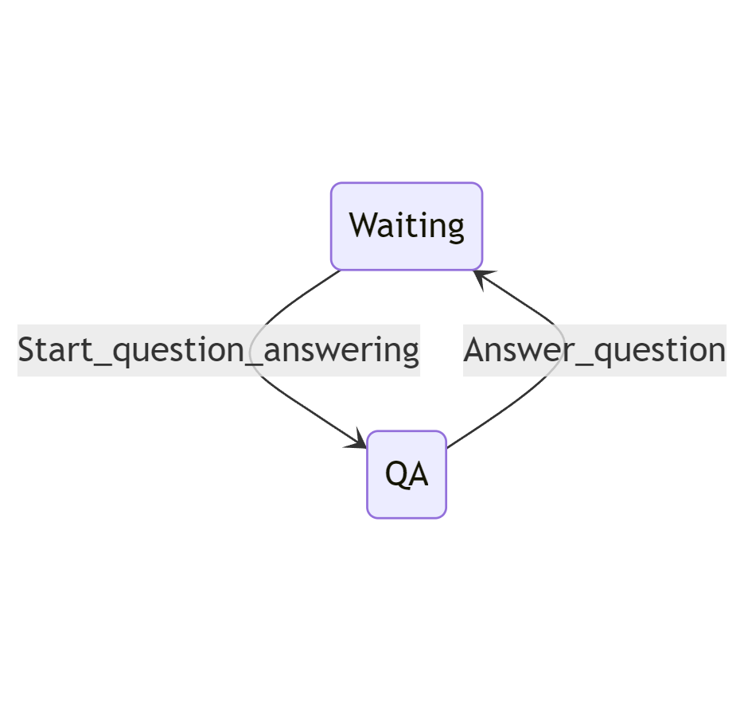
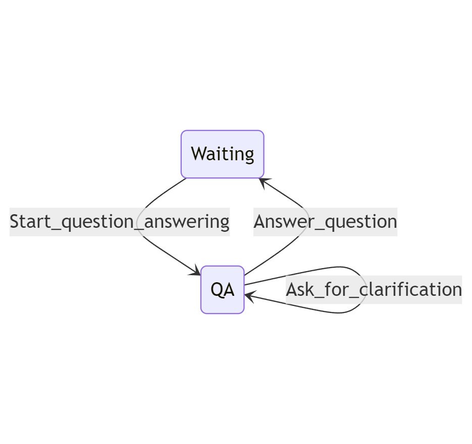
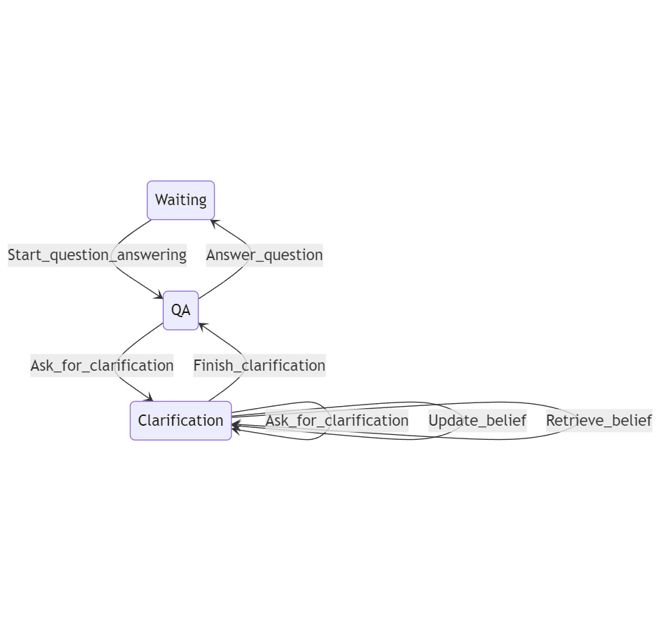
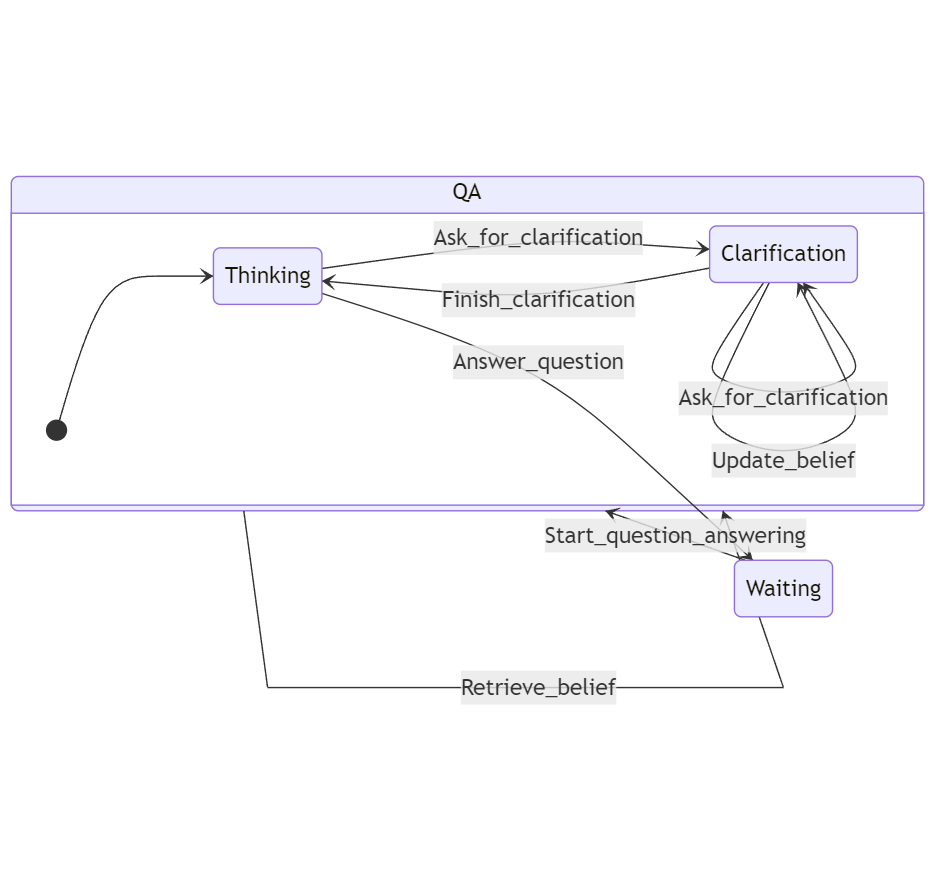
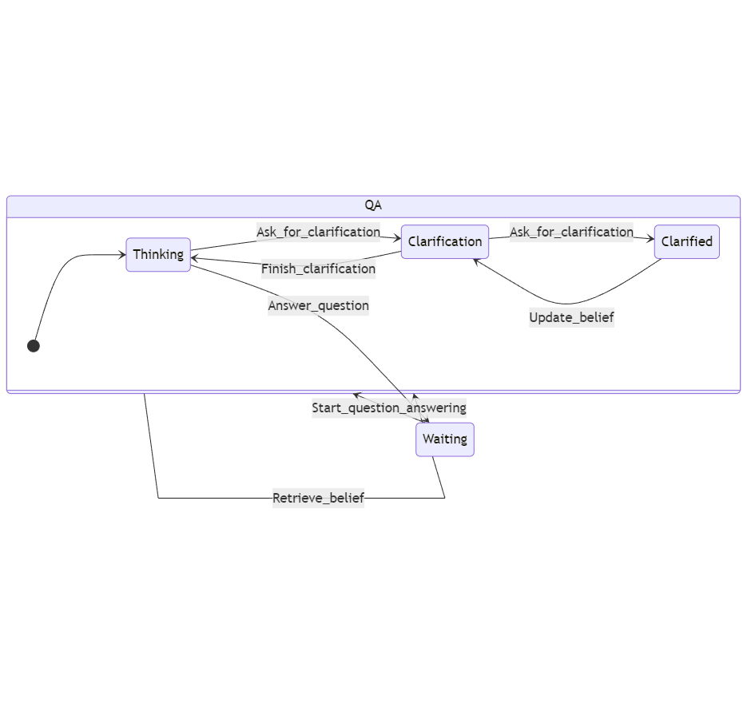
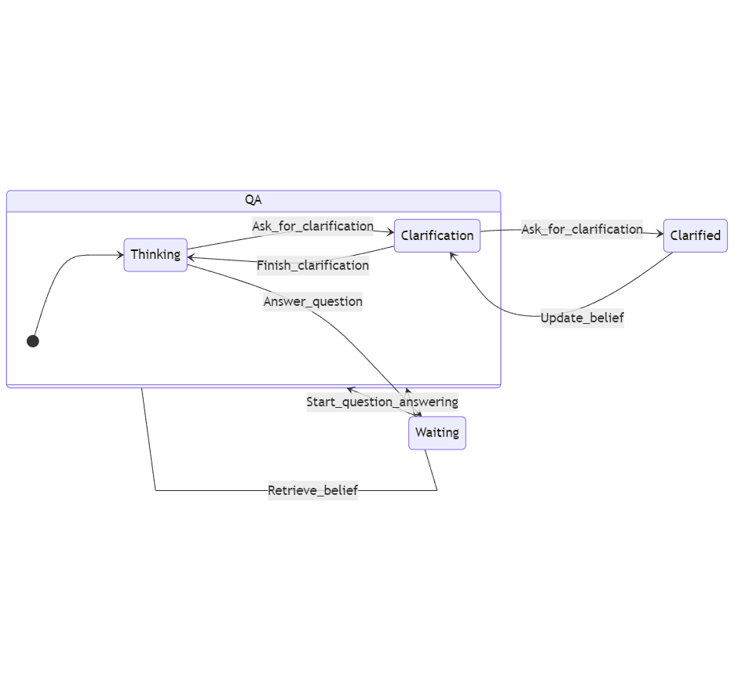

Controlling Agents with States
==============================

In this tutorial, we will demonstrate how
`Sherpa <https://github.com/Aggregate-Intellect/sherpa>`__\ ’s agentic
behavior can be combined with state machines to create controllable
behavior.

.. note:: 
    Sherpa relies on ``pytransition`` for managing states. You
    can read more about ``pytransition`` `here <https://github.com/pytransitions/transitions>`__

If you are unsure about what state management is and why it is useful
for agents. You can read this `blog
post <https://aisc.substack.com/p/llm-agents-part-6-state-management>`__
about the importance of states and how to use state management with
agents.

Context
-------

Recall that in the `question answering
demo <https://github.com/Aggregate-Intellect/sherpa/tree/main/demo/question_answering>`__,
we used Sherpa to create a simple agent that can answer user’s
questions. However, in this simple example, the agent will try to answer
the question even if the the question contains vague or unspecified
information.

For example, if I ask *What is the distance between city A and city B*,
the agent should ask clarification questions to us such as *Where is
city A?*. One way to do this is by trying different prompts to ensure
that the LLM will ask a clarification question when the input is not
enough. However, we can also specify this **explicitly** with states in
Sherpa.

If we show the (implicit) state diagram for the questions answering
case, it looks like the following:

.. code:: mermaid

   stateDiagram
   Waiting --> QA: Start_question_answering
   QA --> Waiting:Answer_question 

Initially, the agent is waiting for questions from the user. As soon as
a question is input from the user, the agent moves to the ``QA`` state.
It can only perform one transition in this state: ``answer`` the
question by providing the results, in which case the agent will go back
waiting for the next transition.

Now, we can explicitly add a new transition in the ``QA`` state so that
it can ask clarification question bug stays in the same state.

.. code:: mermaid

   stateDiagram
   Waiting --> QA:Start_question_answering
   QA --> Waiting:Answer_question 
   QA --> QA:Ask_for_clarification 

Say now that we would like the agent to also update it’s memory (belief)
during the clarification so that we don’t need to repeat the same
information again. We can make a state specifically for
clarification-related behavior.

.. code:: mermaid

   stateDiagram
   Waiting --> QA:Start_question_answering
   QA --> Waiting:Answer_question 
   QA --> Clarification:Ask_for_clarification 
   Clarification --> Clarification:Ask_for_clarification 
   Clarification --> Clarification:Update_belief 
   Clarification --> Clarification:Retrieve_belief
   Clarification --> QA:Finish_clarification

Now, when the agent receives a question, it first decide whether it can
answer the question right away, if this is the case, it will use
``Answer_question``. Otherwise it can transit to the Clarification state
to ask for clarification or modify its belief.

Looking at the diagram above, we noticed that the ``Retrieve_belief``
transition is potentially misplaced. If the agent can retrieve the
information from belief, it will not even need to go for clarification.
That is, we would like the ``Retrieve_belief`` transition to be
accessible in both the ``QA`` state and the ``Clarification`` state. We
can utilize the hierarchical ability in Sherpa’s state management:

.. code:: mermaid

   stateDiagram
   direction LR
   state QA {
   [*] --> QA_Thinking
   state "Thinking" as QA_Thinking
   state "Clarification" as QA_Clarification
   }
   Waiting --> QA:Start_question_answering
   QA_Thinking --> Waiting:Answer_question 
   QA_Thinking --> QA_Clarification:Ask_for_clarification 
   QA_Clarification --> QA_Clarification:Ask_for_clarification 
   QA_Clarification --> QA_Clarification:Update_belief 
   QA --> QA:Retrieve_belief
   QA_Clarification --> QA_Thinking:Finish_clarification

Notice that now ``QA`` is a container state that contains two states
``Thinking`` and ``Clarification``. And ``Retrievel_belief`` transition
can happen in either the two sub states.

Sometimes if we give too much freedom to the agent, it may not perform
very well. In this case, the ideal case is that the agent will store
important information using the ``Update_belief`` transition after
``Ask_for_clarification``. However, this is not enforced. We can
enforced this order explicitly by adding a new state:

.. code:: mermaid

   stateDiagram
   direction LR
   state QA {
   [*] --> QA_Thinking
   state "Thinking" as QA_Thinking
   state "Clarification" as QA_Clarification
   state "Clarified" as QA_Clarified
   }
   Waiting --> QA:Start_question_answering
   QA_Thinking --> Waiting:Answer_question 
   QA_Thinking --> QA_Clarification:Ask_for_clarification 
   QA_Clarification --> QA_Clarified:Ask_for_clarification 
   QA_Clarified --> QA_Clarification:Update_belief 
   QA --> QA:Retrieve_belief
   QA_Clarification --> QA_Thinking:Finish_clarification

Implementation
--------------

Now, let’s implement an agent on this state machine using Sherpa. Full
code for this example is available
`here <https://github.com/Aggregate-Intellect/sherpa/tree/main/demo/state_based_question_answering>`__.

In ``actions.py``, we defined some actions that are useful to happen
during transitions from one state to another. With the help of
``pytransition``, we can define the above transition as a ``JSON``
object in ``states.py``:

.. code:: json

   states = [
       "Start",
       {"name": "Waiting", "on_enter": "start_question"},
       {
           "name": "QA",
           "children": ["Thinking", "Clarification", "Clarified"],
           "initial": "Thinking",
       },
   ]
   initial = "Start"

   transitions = [
       {
           "trigger": "start",
           "source": "Start",
           "dest": "Waiting",
       },
       {"trigger": "Start_question_answering", "source": "Waiting", "dest": "QA"},
       {
           "trigger": "Ask_for_clarification",
           "source": "QA_Thinking",
           "dest": "QA_Clarification",
       },
       {
           "trigger": "Ask_for_clarification",
           "source": "QA_Clarification",
           "dest": "QA_Clarified",
           "before": "clarify_question",
       },
       {
           "trigger": "Update_belief",
           "source": "QA_Clarified",
           "dest": "QA_Clarification",
           "before": "update_belief",
       },
       {
           "trigger": "Retrieve_belief",
           "source": "QA",
           "dest": "QA",
           "before": "retrieve_belief",
       },
       {
           "trigger": "Finish_clarification",
           "source": "QA_Clarification",
           "dest": "QA_Thinking",
       },
       {
           "trigger": "Answer_question",
           "source": "QA_Thinking",
           "dest": "Waiting",
           "before": "answer_question",
       },
   ]

In this example, we use Sherpa’s default policy (ReAct) to navigate the
state machine. Now, let’s run ``main.py`` and then we can start asking
quesitons::

    U: What is the distance between city A and city B
    Sherpa:
        * Start_question_answering (Waiting -> QA.Thinking)
        * Ask_for_clarification (QA.Thinking -> QA.Clarification)
        * Ask_for_clarification: Could you please specify which city A and city B you are referring to (QA.Clarification -> QA.Clarified)
    U: City A is Toronto
    Sherpa:
        * Update_belief: {"cityA": "Toronto"} (QA.Clarified -> QA.Clarification)
        * Ask_for_clarification: Could you please specify the second city B you are referring to? (QA.Clarification -> QA.Clarified)
    U: City B is Beijing
    Sherpa:
        * Update_belief: {"cityA": "Beijing"} (QA.Clarified -> QA.Clarification)
        * Finish_clarification (QA.Clarification -> QA.Thinking)
        * Answer_question: The distance between Toronto and Beijing is approximately 6,300 kilometers (3,900 miles) when measured in a straight line. (QA.Thinking -> Waiting)

You can refer the state machine above to see how Sherpa traverses
through the states. Notice that now Sherpa also stores key information
in the clarification into its belief. Let’s try to utilize this belief
in the follow up conversation::

    U: Which country is city B located at?
    Sherpa:
    	* Start_question_answering (Waiting -> QA.Thinking)
    	* Retrieve belief: "cityB" (QA.Thinking -> QA.Thinking)
    	* Answer_question: City B, Beijing, is located in China. (QA.Thinking -> Waiting)
    U: What is the distance between city A and city C?
    Sherpa: 
    	* Start_question_answering (Waiting -> QA.Thinking)
    	* Ask_for_clarification (QA.Thinking -> QA.Clarification)
    	* Ask_for_clarification: Could you please specify the names of city A and city C? QA.Clarification -> QA.Clarified)
    U: City C is New York
    Sherpa:
    	* Retrieve_belief {'key': 'city_info.A'} (QA.Clarified -> QA.Thinking)
    	* Answer_question: The distance between Toronto (City A) and New York (City C) is approximately 560 kilometers (about 348 miles) when traveling directly. (QA.Thinking -> Waiting)

Notice that in ``main.py``, we manually set the maximum context size of
the agent to be 100 tokens by ``belief.max_tokens=100`` to force the
agent to check the belief explicitly when necessary. In practice, such
retrieval is useful when the amount of data is more than the context
size of the LLM or there are some important data the agent has to
retrieve explicitly.

In the last step, the agent choose ``Retrieve_belief`` transition right
after ``Ask_for_clarification`` instead of ``Update_belief`` since
``Retrieve_belief`` is available in every states of the QA state. If we
want to force the agent to update its belief after the clarification, we
can move the ``Clarified`` state outside of the ``QA`` state. Indeed,
one of the biggest advantage of this explicit state management is that
now we can easily change the behavior of the agent by adjusting the
state machine, without touching the rest of the project!

.. code:: mermaid

   stateDiagram
   direction LR
   state QA {
   [*] --> QA_Thinking
   state "Thinking" as QA_Thinking
   state "Clarification" as QA_Clarification
   }
   Waiting --> QA:Start_question_answering
   QA_Thinking --> Waiting:Answer_question 
   QA_Thinking --> QA_Clarification:Ask_for_clarification 
   QA_Clarification --> Clarified:Ask_for_clarification 
   Clarified --> QA_Clarification:Update_belief 
   QA --> QA:Retrieve_belief
   QA_Clarification --> QA_Thinking:Finish_clarification

