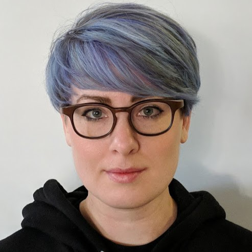

=============================================================================
Community-based Evaluation of Large Language Models: Challenges and Solutions 
=============================================================================
*Meg Risdal* 

Summary 
-------
In this presentation, Meg discusses the challenges in evaluating innovative work, like large language models (LLMs), and proposes solutions to address these challenges. The foundation for the remarkable advances in the field of machine learning is a rigorous process of peer review. New results are subject to significant scrutiny via peer review from expert reviewers, compared to a wide range of relevant benchmarks, and are independently reproduced by other researchers as part of the overall validation cycle of a mature scientific discipline. In this talk, we examine some of the structural issues that may be causing parts of this process to be breaking down in our field, and note the ways that the rapid expansion and growth of the field may be exacerbating these problems. We then move on to show how a transparent, community-driven approach can help to address many of these fundamental, structural issues through a different structural approach. From a broad perspective, it turns out that machine learning competitions and other open challenges have exactly the characteristics that allow us to address the bottlenecks and constraints identified above in a massively parallel way, where the parallelization happens across the open community. We argue that for this reason such competitions and challenges are more important now than ever before, and show how they can improve the quality, trustworthiness, and rigor of results while simultaneously increasing the pace of progress for the field.

`RECORDING <https://youtu.be/gIS_dvuNido>`__

Topics: 
-------
Challenges in Empirical Machine Learning 
	* Reproducibility Crisis: Difficulty in reproducing results and misalignment of incentives within the academic system. Solutions include fostering collaboration and openly sharing failures and successes. 
	* Robust Evaluation Crisis: Need for rigorous evaluation of machine learning models. Solutions include carefully designed benchmark tasks, exploration and analysis of datasets, and probing of model behaviors. 
	* Reviewer Pool Crisis: Overtaxed pool of reviewers due to exponential growth in conference submissions. Solutions include introducing external third-party stress testing and validation, gamification to incentivize participation, and crowd-enabled assessment and ranking. 
Solutions to the Crises 
	* Structural change in how empirical machine learning progresses: Parallelized independent attempts approach, followed by shared objective evaluation and ranking. 
	* Real-time knowledge sharing: Facilitated by a broader diversity of expertise and perspectives. 
	* Implementation in Kaggle Competitions: Example of parallelized structure for empirical rigor, with access to training data, hidden test sets, public leaderboard, and open community for knowledge sharing. 

----

**Meg Risdal (Sr. Product Manager @ Google / Kaggle)**

`Meg <https://www.linkedin.com/in/megan-risdal-4617812a/>`__ is a lead Product Manager at Kaggle based in Toronto. Her academic background is in linguistics where she studied sociophonetics and language variation. She has Master's degrees from UCLA and North Carolina State University.

