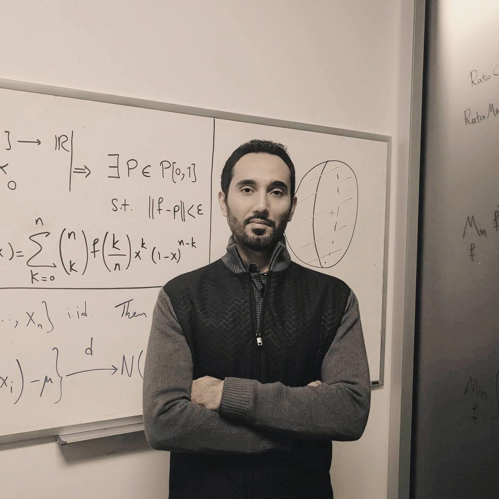

Modern Innovations in Fine-Tuning Large Language Models
=======================================================

In this presentation, we will explore the latest breakthroughs in
fine-tuning large language models. Our conversation will encompass
various fine-tuning techniques, including instruction following
fine-tuning and reinforcement learning through human feedback (RLHF).
Additionally, we will delve into computational aspects like scaling
laws, parameter-efficient fine-tuning (PEFT), and the zero redundancy
optimizer (ZeRO).

`SLIDES <https://github.com/Aggregate-Intellect/sherpa/blob/main/docs/LLM%20Foundations/FT_LLMs_EK.pdf>`__
\| `RECORDING <https://youtu.be/Bn2ZK_ctPbo>`__

**SUMMARY**

-  Fine-tuning large language models is one of the most pressing topics
   in the field.
-  Customized models that are specific for domains and problems can be
   created through fine-tuning.
-  Transformer-based models are the focus of this talk, particularly
   those related to auto-regressive tasks.
-  Self-supervised training is mostly used for pre-training large
   language models, either through MLM or CLM.
-  Next token prediction is the main approach for pre-training, which is
   a simple setup and allows training on any kind of text.
-  Tokenization is a key concept in pre-training since it allows to
   tokenize almost anything, even tabular data.
-  The whole Internet can be a playground for pre-training large
   language models.
-  Large language models require scale to achieve good results.
-  Auto-regressive tasks push the model to learn interesting patterns
   and concepts.
-  Pre-trained language models are not usable in their raw form and
   require fine-tuning.
-  Fine-tuning is the process of extracting knowledge from pre-trained
   language models through injection of new biases and data sets.
-  There are two main methods of fine-tuning: supervised and
   reinforcement learning with human feedback.
-  In supervised fine-tuning, a diverse set of prompts compatible with
   the task is created.
-  Financial prompts may be used for tasks related to financial
   modeling.
-  Two main methods of fine-tuning are supervised fine-tuning and
   reinforcement learning with human feedback.
-  In supervised fine-tuning, a diverse set of prompts compatible with
   the task is created and shown to labelers who complete those prompts
   with the query appropriate for the task.
-  Reinforcement learning with human feedback (RLHF) is a more complex
   fine-tuning method that can replace human labelers with another AI or
   specific type of data.
-  RLHF works by exposing prompts to the model, getting responses from
   the model, then showing these responses together with the question to
   labelers who rank the responses.
-  The ranking mechanism is used to create a rewarding rule, which is
   then applied to every reinforcement learning to the base model.
-  There is a lot to learn and talk about when it comes to the RLHF
   method, and the UC Berkeley Reinforcement learning team has a
   comprehensive slideshow on it.
-  The speaker is creating a course on RLHF and it’s free on YouTube,
   based on the Claus Allega diagram.
-  The speaker provides a real-time demo of how supervised fine-tuning
   changes the behavior of the model.
-  The fine-tuning process improves the performance of the model by
   making it more usable and focused on a specific type of interaction.
-  GPT and GPT-45 models achieved success by finding a way to tune the
   models in a usable format.
-  The fine-tuned model responds to prompts more accurately and provides
   relevant information.
-  There are pros and cons to both supervised fine-tuning and
   reinforcement learning with human feedback approaches to fine-tuning
   LLMs.
-  Online data collection for RLHF can be a weakness, while offline data
   collection for supervised fine-tuning is easier.
-  RLHF suffers less from catastrophic forgetting than supervised
   fine-tuning.
-  The amount of data needed for fine-tuning an LLM is an open question,
   but empirical results suggest tens of thousands of samples are
   needed.
-  The current benchmarks for measuring the quality of LLMs are not
   applicable and better metrics are needed.
-  Scaling laws for pre-training have been partially answered, but the
   question of fine-tuning is still vital.
-  Methods such as Path and Laura are used for parameter efficient
   fine-tuning, but each has strengths and weaknesses.
-  The speaker acknowledges the difficulty of answering some of the
   questions and that they are still being researched.
-  The conversation shifts to discussing what ML developers can do at
   home to work with LLMs. However, the AI did not provide any specific
   takeaways related to this topic.
-  It is possible to run smaller models using methods such as RLHF, even
   with limited compute such as a GPU from a platform like Colab.
-  Open source models and datasets, such as those from OpenAI and the
   Open Assistant effort, can be used for fine-tuning LLMs.
-  The methods discussed in the talk are model agnostic, allowing for
   flexibility in choosing which model to use.
-  The best LLM models for a single machine are currently open source,
   such as LAMA from Facebook and models from PCR.
-  Labeling tools such as Scale AI and Open Assistant can be used for
   collecting data for training LLMs.
-  Synthetic data generation is a potential method for generating
   training data for internal LLM models.
-  Applying reinforcement learning to fine-tune LLMs is a generic method
   that can be applied to any model, and has origins outside the
   language domain.
-  While specific fine-tuning methods like soft prompts and prompt
   tuning have emerged, it is important to stick to the principles and
   not become too attached to any one method.
-  Data is ultimately the goal for training LLMs, and the success of
   these models can be attributed to the unique data they have been
   trained on.
-  AWS has announced initiatives to create foundational models and
   collaborate with other labs to make their open source models more
   widely available.
-  AWS does not make money from models, but instead from compute, so it
   makes sense for them to publish data and models.

*Resources*

-  Check out Ehsan’s series on LLMs: `YouTube
   Playlist <https://www.youtube.com/watch?v=p7JYu65lDyY&list=PLb9xatikqn0fwsS-Le1mkyQ2uZzK8DeP1>`__

**Ehsan Kamalinejad (ML Scientist @ Amazon)**

`Ehsan <https://www.linkedin.com/in/ehsan-kamalinejad/>`__ is a machine
learning scientist. He is currently a lead scientist working on NLP
developments at Amazon. Previously he co-founded Visual One which was a
YCombinator startup in computer vision. Before that he was working at
Apple for several years as a tech-lead machine learning scientist
working on projects such as Photos Memories. Ehsan is also an associate
professor at California State University. He got his PhD from the
University of Toronto in applied mathematics.

