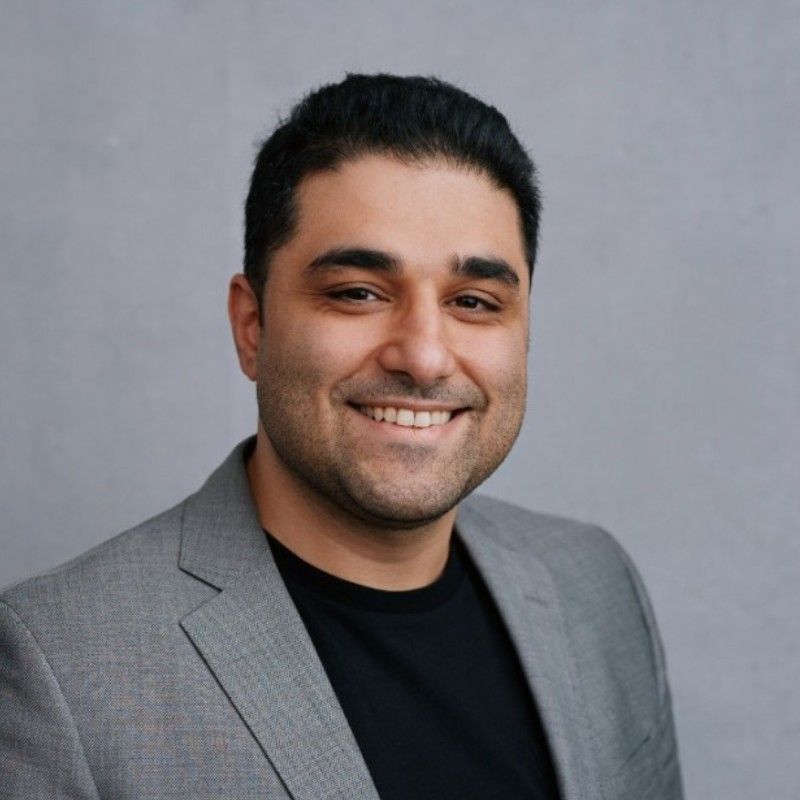

=========================================================
Technical Customer Experience and Effective Communication 
=========================================================
*Chandan Maruthi* 

Summary 
-------
​Twig empowers developer-focused companies to deliver world-class customer support, with four times less staff using AI agents and contextual domain data. The founders are experienced AI and CX professionals from H2O ai, Workday, and Intel. In just four months we already have $50k ARR.

Chandan Maruthi discusses the problem of technical customer experience teams not effectively using support AI tools and presents a solution. He also talks about the market opportunity, the company's vision, target customers, go-to-market strategy, and the process of ingesting data. Moien Giashi, Amir Feizpour, and Chandan Maruthi also discuss effective communication in pitch decks and provide recommendations. 

`RECORDING <https://youtu.be/yIVoJoBOcvU>`__

Topics: 
-------
Technical Customer Experience 
	* Technical customer experience teams face challenges in effectively using support AI tools 
	* The company aims to provide a solution that meets the specific needs of these teams 
	* The solution consists of three pillars of data: public and private data from customers, a data marketplace, and synthetic data 
	* The vision is to build a vertically integrated stack with a semantic case layer and APIs for embedding into customers' ecosystems 
	* Live customers include Basis Technologies, Visible Hand, MedTech Platform, Trade Builder Card, and Personal Perspect 
	* Target customers are VP of Customer Success at tech companies, particularly in the dev tools and vertical SAS space 
	* Go-to-market strategy includes proper enterprise sales process for customers with a value exceeding $10,000 and leveraging distribution channels for customers below that threshold 
	* The process of ingesting data, training applications, and hosting data on the platform was demonstrated 
	* Integration process takes about a month for large enterprise customers and minutes for smaller customers using the self-serve model 
	* Raising money to launch capabilities through a Zendesk app exchange 
Effective Communication in Pitch Decks 
	* Clear and concise communication is important in pitch decks 
	* Strike a balance between promoting ideas and providing justifications 
	* Find a balance between promotive and preventive communication 
	* Be selective with the information included in the pitch deck 
	* Consider creating a separate appendix deck for additional details 
	* Include detailed product roadmap and future plans in the data room 

----

**​Chandan Maruthi (Co-Founder & CEO @ Twig)**

`​Chandan Maruthi <https://www.linkedin.com/in/chandanmaruthi/>`__ is the co-Founder and CEO, Ex H2O ai, LambaSchool, E2Open

----

**​Moien Giashi (Sr. Investment Associate - Deep Tech @ Greensky Ventures)**

`​Moien Giashi <https://www.linkedin.com/in/moien-giashi/>`__ is a seasoned professional with diverse expertise in the biomedical industry, materials science, and research. Currently, as the Senior Investment Associate at GreenSky Capital, he leads deep tech investments, applying his extensive knowledge to identify promising opportunities. Moien also excels in advisory, strategy, business consulting, fundraising, and product development for startups across various sectors. His contributions as a Venture Partner with ArchAngel Network of Funds-Axion Fund and as a Scientific Affairs Associate at Baylis Medical (now Boston Scientific) have further enriched his career. Previously, as a Senior Venture Manager at CDL-Toronto, Moien played a pivotal role in securing over $12 million in investments for numerous companies. His remarkable journey showcases a true passion for driving innovation and fostering growth within the biotech and investment landscapes.

