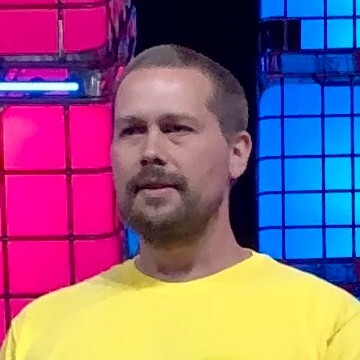

==================================
Automating Data Extraction with AI
==================================
*Tavis Lochhead* 

Summary 
-------
​Kadoa automates data extraction with AI. Data extraction is a $6B market on the cusp of explosion as a result of LLMs. Kadoa currently focuses on web HTML data extraction with plans to expand to PDFs, emails, and more

Tavis Lochhead, one of the founders of Kodoa, introduced their company's mission to automate data extraction using AI. He emphasized the importance of data in today's world and explained how Kodoa's solution can automate the laborious process of extracting data from unstructured formats. Lochhead showcased their technology's ability to extract structured data from various websites. Kodoa aims to offer their services to companies in need of structured data for various use cases such as lead generation and e-commerce monitoring. Lochhead shared a success story of a job board client and expressed their commitment to building a strong infrastructure and pursuing larger deals in the future. The Q&A session provided feedback and suggestions for improvement, including enhancing the visuals, providing step-by-step demonstrations, condensing text-heavy slides, adding market size information, and including details on the business model, revenue projections, competitors, traction, and funding requirements. The speakers also acknowledged the need to improve storytelling and address the bottom-up approach in the market slide. 

`SLIDES <#>`__
\| `RECORDING <https://youtu.be/mNGEdJFA3eA>`__

Topics: 
-------
Kodoa's Mission 
	* Kodoa aims to automate data extraction using AI 
	* Data extraction from unstructured formats is laborious and time-consuming 
	* Kodoa's solution combines advanced machine learning tasks with autonomous agents 
	* Their focus is on extracting data from websites 
	* Kodoa's technology can extract structured data from various career pages 
	* Use cases include lead generation and e-commerce monitoring 
	* Success story of reducing extraction time and eliminating manual management 
	* Commitment to building a strong infrastructure and pursuing larger deals 
Feedback and Suggestions 
	* Improve clarity and legibility of visuals 
	* Provide step-by-step demonstrations of Kodoa's solution 
	* Condense text-heavy slides and highlight key numbers 
	* Include market size and potential impact for each vertical in use cases 
	* Add more information on the team without overcrowding the slide 
	* Include information on business model, revenue projections, competitors, traction, and funding requirements 
	* Emphasize Kodoa's unique value proposition of enabling non-technical users to scrape and integrate data 
	* Enhance storytelling aspect and address the bottom-up approach in the market slide 

----

**Tavis Lochhead (Co-Founder & CRO @ Kadoa)**

`Tavis Lochhead <https://www.linkedin.com/in/tavislochhead/>`__ is the Co-Founder and CRO of Kadoa. He has 10+ years of B2B marketing leadership experience with startups and large enterprises, including Cisco

----

**​Moien Giashi (Sr. Investment Associate - Deep Tech @ Greensky Ventures)**

`​Moien Giashi <https://www.linkedin.com/in/moien-giashi/>`__ is a seasoned professional with diverse expertise in the biomedical industry, materials science, and research. Currently, as the Senior Investment Associate at GreenSky Capital, he leads deep tech investments, applying his extensive knowledge to identify promising opportunities. Moien also excels in advisory, strategy, business consulting, fundraising, and product development for startups across various sectors. His contributions as a Venture Partner with ArchAngel Network of Funds-Axion Fund and as a Scientific Affairs Associate at Baylis Medical (now Boston Scientific) have further enriched his career. Previously, as a Senior Venture Manager at CDL-Toronto, Moien played a pivotal role in securing over $12 million in investments for numerous companies. His remarkable journey showcases a true passion for driving innovation and fostering growth within the biotech and investment landscapes.

.. image:: ../_imgs/MoienG.jpeg
  :width: 400
  :alt: ​​Moien Giashi Headshot