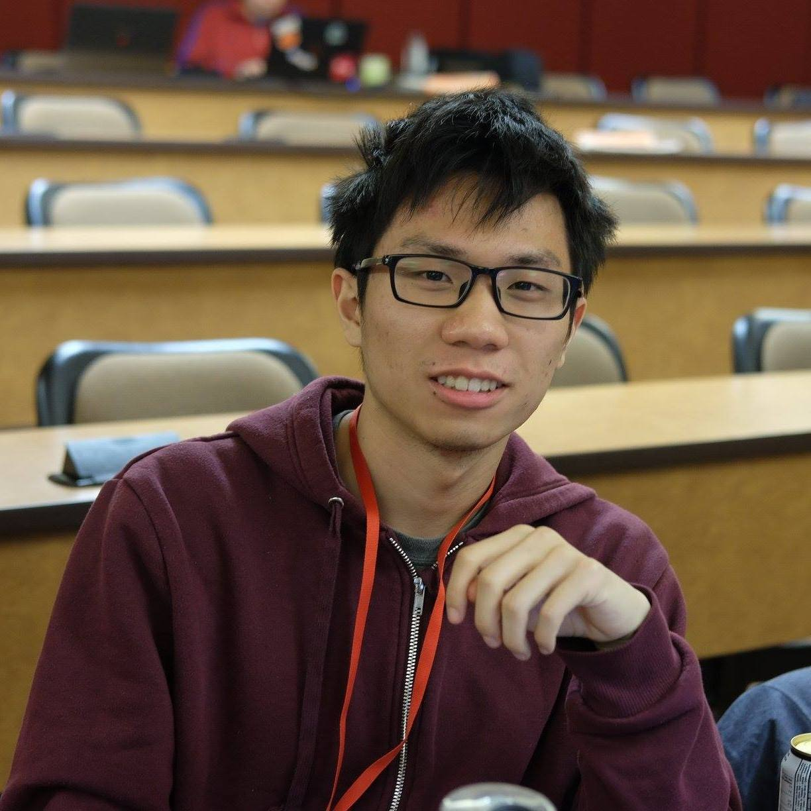

Building with LLMs Using LangChain - Hands-on
=============================================

This workshop focuses on Large Language Models (LLMs) and their
capabilities in language understanding and generation. Despite their
impressive performance, LLMs still face challenges in tasks like
retrieval and math reasoning. Fortunately, several tools are available
for these tasks. LangChain is a Python library that enables the
integration of LLMs with external tools to accomplish a wide range of
tasks. The workshop will provide an overview of LangChain’s basics and
demonstrate how it can interface with external tools. Additionally, we
will create a simple system using LangChain to answer questions about
itself LangChain itself.

`NOTEBOOK <https://colab.research.google.com/drive/1j-vDz0TWkwMavH6ld3K3V8uGMCsGJe-S?usp=sharing>`__
\|
`SOLUTIONS <https://colab.research.google.com/drive/19ZZnxN8W_uw5nrZ6nE4c5ZKeH3PTjZta?usp=sharing>`__
\| `RECORDING <https://youtu.be/MGB2uahuX_o>`__

**SUMMARY**

1.  Large language models can be used with other systems to incorporate
    external knowledge or long term knowledge.
2.  LangChain can be made more interesting by incorporating the idea of
    a chain, which consists of a prompt template and a large language
    model.
3.  The prompt template can be used to reduce repetition and input
    specific information later on.
4.  There are various configurations that can be done with the large
    language model, such as setting the temperature for randomness in
    generation.
5.  LangChain can be made more interesting by incorporating the idea of
    a chain, which consists of a prompt template and a large language
    model.
6.  The concept of short-term memory can be incorporated into LangChain
    by using a conversation buffer memory to retain previous
    conversations.
7.  Adding history about conversations to the prompt can help the model
    incorporate external knowledge and interact within a particular
    context.
8.  A comparison between Lama index and LangChain can be found in
    Suhas’s talk.
9.  It is possible to correct LLMS previous responses using subsequent
    prompts, either through memory or by providing external knowledge.
10. External knowledge can be incorporated into a large language model
    by storing a snapshot of the knowledge in a vector database and
    retrieving relevant information to incorporate into a prompt.
11. LangChain documentation can be used as a context for a large
    language model to answer questions about LangChain.
12. Documents can be broken down into smaller chunks to store relevant
    information in a more manageable way.
13. The TikToken package can be used to split documents into smaller
    chunks.
14. OpenAI Embedding package can be used to embed the chunks of
    documents for storage in a vector database.
15. Files can be used as a reactive database to store the vector
    embeddings.
16. The Load QA Chain tool from LangChain can be used to create a
    question answering chain by providing external documents and a
    question.
17. Adding external knowledge improves the accuracy of the large
    language model’s answers to specific questions.
18. Different types of documents such as YouTube video transcripts or
    images can be used as external knowledge.
19. There are different types of vector databases available for use with
    LangChain, including in-memory and more scalable options.
20. LangChain simplifies the process of using large language models by
    integrating various tools and databases into a single framework.
21. Post-processing and checking are necessary to ensure that the
    model’s output meets expectations, as it may still produce
    unexpected results.

*Resources*

-  `LangChain
   Tutorials <https://github.com/gkamradt/langchain-tutorials>`__

**Percy Chen (PhD Student @ McGill University)**

`Percy <https://www.linkedin.com/in/boqi-chen/>`__ is a PhD student at
McGill University. His research interests include model-driven software
engineering, trustworthy AI, verification for ML systems, Graph Neural
Networks, and Large Language Models. Percy leads R&D collaboration
between McGill University and Aggregate Intellect.

